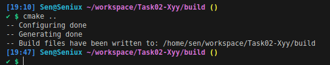
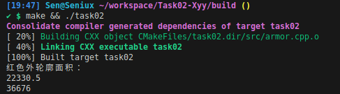
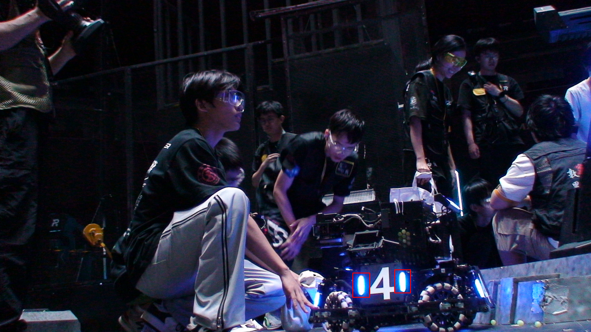

# Task02 OpenCV基础与装甲板识别

### 完成思路

##### 目标：框出装甲板的灯条部分

1. 颜色预处理：设置BGR颜色范围，降低非蓝色区域的曝光度，为后续二值化做准备
2. 颜色通道处理：利用颜色分量差异（B通道减去R通道）突出蓝色目标，抑制红色等干扰色
3. 图像二值化：将处理后的图像转换为二值图像
4. 形态学处理：使用开闭运算等操作优化二值图像质量
5. 轮廓检测：查找所有轮廓并过滤掉面积过小的噪声轮廓
6. 目标标注：为符合条件的轮廓绘制边界框

### 获取相关资料的方式
1. OpenCV官方文档：查阅了OpenCV的图像处理函数用法和参数说明
2. RoboMaster社区：参考了其他战队在装甲板识别方面的技术分享
3. CSDN技术博客：查找了颜色分割、轮廓检测等相关技术的实现方法
4. GitHub开源项目：研究了类似视觉识别项目的代码结构

### 结构

```txt
project/
├── CMakeLists.txt         # 项目构建配置
├── src/                   # 源文件目录
│   ├── main.cpp           # 主程序入口
│   ├── utils.cpp          # 基础操作工具函数
│   └── armor.cpp          # 装甲板检测实现
├── resources/             # 测试图片
└── output/                # 结果图片
```

**cmake截图**


**make截图**


**识别效果**
